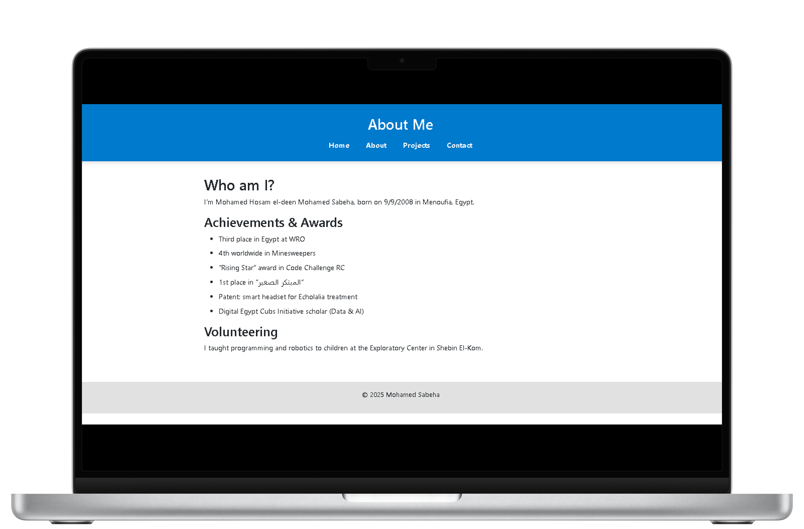

# 🌟 Mohamed Sabeha Portfolio

Welcome to my personal portfolio!  
I'm **Mohamed Hosam el-deen Mohamed Sabeha**, an aspiring web developer and tech entrepreneur from Egypt 🇪🇬.

This website showcases my projects, achievements, skills, and story as I aim to build digital solutions that help my community and beyond.

---

## 🧰 Tech Stack
- **Frontend:** HTML, CSS, JavaScript
- **Backend:** (Optional) Flask
- **Database:** SQLite (planned for dynamic content)

---

## ✨ Features
✅ Modern responsive design (mobile-friendly)  
✅ Multilingual support (English & Arabic planned)  
✅ About me page with achievements & volunteering  
✅ Project showcase with real examples  
✅ Contact form / contact info  
✅ Easy to extend with blog or downloads section

---

## 🏆 Achievements & Volunteering
- 🥉 Third place in Egypt at **WRO**
- 🌍 4th worldwide in **Minesweepers**
- ⭐ *“Rising Star”* award at **Code Challenge RC**
- 🥇 1st place in **المبتكر الصغير**
- 📜 Patent holder: *smart headset for Echolalia treatment*
- 🎓 Scholarship: **Digital Egypt Cubs Initiative (Data & AI)**
- 👨‍🏫 Volunteered teaching programming & robotics at the Exploratory Center in Shebin El-Kom

---

## 📸 Screenshots
> *(Add screenshots here to make your repo look more visual!)*
```html



